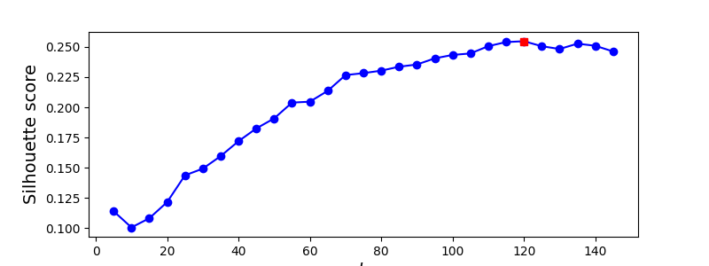

# Olivetti Faces & PCA

For this assignment, we explored dimensionality reduction with the Olivetti Faces dataset using principal component analysis (PCA). We did this by using K-Means unsupervised learning at a variety of K's and PCA values.

## Initial Run

For the initial run where we are getting a feel for things, I fit and transformed the entire dataset to a PCA value of 0.95. It was then inputted into a K-Means unsupervised learning model with an initial guess of 100 clusters. This is 2.5 times the number of people (40) in the dataset. When I plotted the clusters of images, there were only a couple to a few clusters that had one image. I would say about half to three fourths of the clusters were pretty good in containing the right person in it, but there were quite a few that would have a couple random people in them.

## PCA Analysis

With using PCA, we lose image detail since we're reducing the dimensions of our dataset. In general, using dimensionality reduction will speed up training since there are likely far fewer features, but it will also likely make your system slightly worse. It also makes your pipelines slightly harder to maintain since it adds complexity. However, there are cases when using dimensionality reduction can help if it ends up filtering out noise or details that aren't necessary. This could likely be explained with the curse of dimensionality. If we have a model with tons of dimensions, we have a greater risk of overfitting it. For example in the MNIST dataset, all the pixels on the borders of the images are usually white so dropping these shouldn't have much affect on the performance of the model.

## Finding the Best K for a given PCA

For finding the best K for a given PCA value, I have a `find_best_k` function that goes through k values from 5 to 150 and fits each k value to a K-means model. It then uses all those fit models and runs silhouette scores on them. Lastly, it will then plot out the scores.

Here, we can see k=120 was best when we had a PCA score of .95. However, this K value changed when the PCA value changed (k=125 was best at PCA score of 0.85).

## Comparison of Various K & PCA Values

|    PCA |   K |   Homogeneity score |   Completeness Score |   V-measure Score |   Silhouette Score |   # of Clusters with > 1 member |
|--------|-----|---------------------|----------------------|-------------------|--------------------|---------------------------------|
| 0.85   |  40 |              0.7691 |               0.8016 |            0.785  |             0.16   |                              40 |
| 0.85   |  50 |              0.816  |               0.7992 |            0.8076 |             0.1716 |                              50 |
| 0.85   |  75 |              0.8959 |               0.7794 |            0.8336 |             0.1873 |                              75 |
| 0.85   |  90 |              0.9341 |               0.7824 |            0.8515 |             0.2035 |                              88 |
| 0.85   |  95 |              0.9364 |               0.774  |            0.8475 |             0.2059 |                              92 |
| 0.85   | 100 |              0.942  |               0.7696 |            0.8471 |             0.206  |                              96 |
| 0.85   | 105 |              0.954  |               0.7731 |            0.8541 |             0.2077 |                             100 |
| 0.85   | 110 |              0.9571 |               0.7673 |            0.8518 |             0.2078 |                             103 |
| 0.85   | 115 |              0.9599 |               0.7626 |            0.85   |             0.2095 |                             106 |
| 0.85   | 120 |              0.9677 |               0.7628 |            0.8531 |             0.2104 |                             108 |
| 0.85   | 125 |              0.9713 |               0.7577 |            0.8513 |             0.2124 |                             113 |
| 0.85   | 130 |              0.9732 |               0.754  |            0.8497 |             0.2079 |                             115 |
| 0.85   | 150 |              0.9857 |               0.7422 |            0.8468 |             0.2091 |                             120 |
| 0.85   | 200 |              0.9953 |               0.7103 |            0.829  |             0.187  |                             119 |
| 0.9    |  40 |              0.7917 |               0.8163 |            0.8038 |             0.1542 |                              40 |
| 0.9    |  50 |              0.8301 |               0.8096 |            0.8197 |             0.165  |                              49 |
| 0.9    |  75 |              0.9158 |               0.7998 |            0.8539 |             0.1867 |                              73 |
| 0.9    |  90 |              0.926  |               0.7772 |            0.8451 |             0.2028 |                              87 |
| 0.9    |  95 |              0.9466 |               0.7812 |            0.856  |             0.2029 |                              93 |
| 0.9    | 100 |              0.9432 |               0.7732 |            0.8498 |             0.2136 |                              95 |
| 0.9    | 105 |              0.9497 |               0.7675 |            0.8489 |             0.2074 |                             103 |
| 0.9    | 110 |              0.9599 |               0.7655 |            0.8517 |             0.2078 |                             108 |
| 0.9    | 115 |              0.9688 |               0.7661 |            0.8556 |             0.2132 |                             112 |
| 0.9    | 120 |              0.9734 |               0.7651 |            0.8568 |             0.2143 |                             113 |
| 0.9    | 125 |              0.9765 |               0.7626 |            0.8564 |             0.2148 |                             114 |
| 0.9    | 130 |              0.981  |               0.7612 |            0.8573 |             0.2158 |                             114 |
| 0.9    | 150 |              0.9877 |               0.7452 |            0.8495 |             0.2089 |                             118 |
| 0.9    | 200 |              0.9946 |               0.7096 |            0.8282 |             0.1895 |                             120 |
| 0.95   |  40 |              0.7656 |               0.7851 |            0.7752 |             0.1481 |                              40 |
| 0.95   |  50 |              0.8261 |               0.7998 |            0.8127 |             0.1616 |                              50 |
| 0.95   |  75 |              0.9135 |               0.8001 |            0.8531 |             0.1908 |                              74 |
| 0.95   |  90 |              0.9364 |               0.7842 |            0.8536 |             0.1954 |                              86 |
| 0.95   |  95 |              0.9353 |               0.7791 |            0.8501 |             0.1998 |                              87 |
| 0.95   | 100 |              0.9424 |               0.7758 |            0.851  |             0.2014 |                              91 |
| 0.95   | 105 |              0.9491 |               0.7703 |            0.8504 |             0.2021 |                              96 |
| 0.95   | 110 |              0.9499 |               0.7601 |            0.8445 |             0.2055 |                             104 |
| 0.95   | 115 |              0.9575 |               0.7595 |            0.8471 |             0.2083 |                             107 |
| 0.95   | 120 |              0.9637 |               0.7586 |            0.849  |             0.2085 |                             109 |
| 0.95   | 125 |              0.9688 |               0.7574 |            0.8502 |             0.2048 |                             108 |
| 0.95   | 130 |              0.9706 |               0.7537 |            0.8485 |             0.2016 |                             110 |
| 0.95   | 150 |              0.9849 |               0.7449 |            0.8483 |             0.21   |                             115 |
| 0.95   | 200 |              0.9931 |               0.709  |            0.8273 |             0.1801 |                             116 |
| 0.99   |  40 |              0.7617 |               0.796  |            0.7785 |             0.1497 |                              40 |
| 0.99   |  50 |              0.8233 |               0.8069 |            0.815  |             0.1652 |                              50 |
| 0.99   |  75 |              0.9005 |               0.7908 |            0.8421 |             0.1832 |                              73 |
| 0.99   |  90 |              0.926  |               0.7794 |            0.8464 |             0.192  |                              88 |
| 0.99   |  95 |              0.9341 |               0.7728 |            0.8458 |             0.1977 |                              92 |
| 0.99   | 100 |              0.9383 |               0.7677 |            0.8444 |             0.1994 |                              95 |
| 0.99   | 105 |              0.948  |               0.7671 |            0.848  |             0.1992 |                             101 |
| 0.99   | 110 |              0.9524 |               0.7626 |            0.847  |             0.2013 |                             101 |
| 0.99   | 115 |              0.9533 |               0.7573 |            0.8441 |             0.2    |                             105 |
| 0.99   | 120 |              0.9656 |               0.7617 |            0.8516 |             0.1998 |                             104 |
| 0.99   | 125 |              0.9624 |               0.7497 |            0.8428 |             0.2034 |                             112 |
| 0.99   | 130 |              0.9784 |               0.7607 |            0.8559 |             0.2113 |                             113 |
| 0.99   | 150 |              0.9776 |               0.74   |            0.8424 |             0.2045 |                             112 |
| 0.99   | 200 |              0.9908 |               0.7091 |            0.8266 |             0.1852 |                             113 |
| 0.999  |  40 |              0.7551 |               0.7875 |            0.7709 |             0.1481 |                              40 |
| 0.999  |  50 |              0.8049 |               0.7848 |            0.7947 |             0.159  |                              50 |
| 0.999  |  75 |              0.8923 |               0.7861 |            0.8359 |             0.1828 |                              72 |
| 0.999  |  90 |              0.9396 |               0.7929 |            0.86   |             0.1959 |                              84 |
| 0.999  |  95 |              0.9446 |               0.7856 |            0.8578 |             0.1996 |                              89 |
| 0.999  | 100 |              0.9475 |               0.7799 |            0.8555 |             0.1985 |                              92 |
| 0.999  | 105 |              0.9513 |               0.7747 |            0.854  |             0.1953 |                              96 |
| 0.999  | 110 |              0.9458 |               0.7646 |            0.8456 |             0.2026 |                             101 |
| 0.999  | 115 |              0.9588 |               0.765  |            0.851  |             0.204  |                             105 |
| 0.999  | 120 |              0.9592 |               0.7602 |            0.8482 |             0.2059 |                             106 |
| 0.999  | 125 |              0.9607 |               0.7534 |            0.8445 |             0.1942 |                             106 |
| 0.999  | 130 |              0.9688 |               0.7549 |            0.8486 |             0.1951 |                             103 |
| 0.999  | 150 |              0.9825 |               0.7431 |            0.8462 |             0.202  |                             117 |
| 0.999  | 200 |              0.9933 |               0.7121 |            0.8295 |             0.1838 |                             110 |
| 0.9999 |  40 |              0.7688 |               0.789  |            0.7788 |             0.1424 |                              40 |
| 0.9999 |  50 |              0.8197 |               0.8064 |            0.813  |             0.1668 |                              50 |
| 0.9999 |  75 |              0.9315 |               0.8109 |            0.867  |             0.1874 |                              75 |
| 0.9999 |  90 |              0.9165 |               0.773  |            0.8387 |             0.1957 |                              87 |
| 0.9999 |  95 |              0.9214 |               0.7684 |            0.838  |             0.1962 |                              91 |
| 0.9999 | 100 |              0.9263 |               0.7642 |            0.8375 |             0.1996 |                              94 |
| 0.9999 | 105 |              0.9467 |               0.7706 |            0.8496 |             0.2059 |                              97 |
| 0.9999 | 110 |              0.9506 |               0.764  |            0.8471 |             0.2072 |                             100 |
| 0.9999 | 115 |              0.9552 |               0.7603 |            0.8467 |             0.2127 |                             104 |
| 0.9999 | 120 |              0.9596 |               0.756  |            0.8457 |             0.2113 |                             107 |
| 0.9999 | 125 |              0.963  |               0.7532 |            0.8453 |             0.2078 |                             109 |
| 0.9999 | 130 |              0.967  |               0.7518 |            0.8459 |             0.2077 |                             109 |
| 0.9999 | 150 |              0.9748 |               0.739  |            0.8407 |             0.2005 |                             108 |
| 0.9999 | 200 |              0.9951 |               0.7132 |            0.8309 |             0.1848 |                             111 |

Rather than counting the number of pure clusters, I ended up calculating a homogeneity, completeness, and v-measure score since I felt these scores convey similar ideas but with more information. These are all from sklearn.metrics and can be used to evaluate clusters. They are described as follows [from the scikit learn documentation](https://scikit-learn.org/stable/modules/generated/sklearn.metrics.homogeneity_completeness_v_measure.html):

  * [Homogeneity score](https://scikit-learn.org/stable/modules/generated/sklearn.metrics.homogeneity_score.html#sklearn.metrics.homogeneity_score): A clustering result satisfies homogeneity if all of its clusters contain only data points which are members of a single class. 
  * [Completeness Score](https://scikit-learn.org/stable/modules/generated/sklearn.metrics.completeness_score.html#sklearn.metrics.completeness_score): A clustering result satisfies completeness if all the data points that are members of a given class are elements of the same cluster.
  * [V-measure Score](https://scikit-learn.org/stable/modules/generated/sklearn.metrics.v_measure_score.html#sklearn.metrics.v_measure_score): This score is defined as the harmonic mean between the two previous scores, homogeneity and completeness. 

I've also calculated the silhouette score again for this, which is a measure of how similar an object is to its own cluster compared to other clusters, ranging from -1 to +1. It studies the separation distance between resulting clusters. A positive value here indicates that the sample is far away from neighboring clusters whereas a negative value indicates the samples may have been assigned to the wrong cluster. We want a value closer to +1, from what I understand.

From this table, we can see that homogeneity and completeness are inversely related. As we increase our K value, homogeneity goes up while completeness goes down. The V-measure score shows us where the best balance between the two is.

Another interesting observation we can make here is that the highest PCA scores (least information lost) didn't necessarily correlate with the best scores overall. For example, for k=120, the PCA value of .9 had the most clusters with more than one member (113), the highest silhouette score (0.2143), and the top v-measure score (0.8568). 